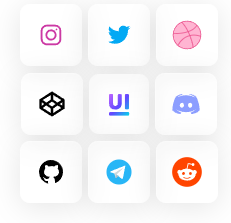
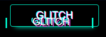
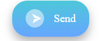
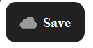

# Model_But

## Model_But is a visual project that showcases four uniquely styled button models, built using only HTML and pure CSS, with no JavaScript functionality. The main focus is to demonstrate creative button design and the visual possibilities achievable through CSS alone.

## 🎨 Included Button Models:
### - "Send" Button with Cloud: A stylish button featuring a cloud icon, suggesting file or message upload. It includes smooth animation and a clean look.
### - Glitch Button: A button with a digital "glitch" effect, simulating screen interference or distortion. Perfect for cyberpunk or tech-themed interfaces.
### - Multi-Buttons (Expandable Button): A main button that reveals additional buttons around it on hover, creating an interactive and elegant UI experience.
### - Zoom Effect Button: A minimal button with a zoom-in animation on click or focus, enhancing the visual feedback in a clean and modern way.

## While these buttons are not functional, they serve as excellent examples of visual prototyping, CSS animations, and creative UI experimentation.

   
   
   
  

